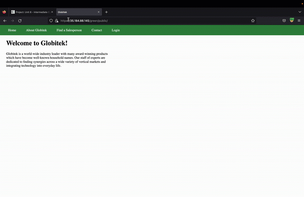
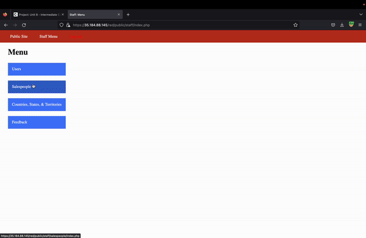
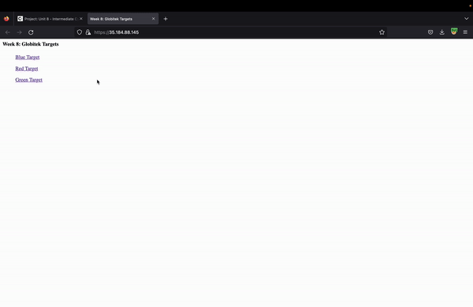

# Pen Testing Live Targets

Time spent: 16 hours spent in total

> Objective: Identify vulnerabilities in three different versions of the Globitek website: blue, green, and red.

The six possible exploits are:

* Username Enumeration
* Insecure Direct Object Reference (IDOR)
* SQL Injection (SQLi)
* Cross-Site Scripting (XSS)
* Cross-Site Request Forgery (CSRF)
* Session Hijacking/Fixation

Each color is vulnerable to only 2 of the 6 possible exploits. First discover which color has the specific vulnerability, then write a short description of how to exploit it, and finally demonstrate it using screenshots compiled into a GIF.

## Green

Vulnerability #1: Cross Sight Scripting

Description: I used a fake email and added a code to the description part of the contact part. After this I logged and went to the feedback part of the website and it told me XSS was found

<

## Red

Vulnerability #1: IDOR

Description: I went to the salesperson part of the website and I noticed the link had some numbers and I changed them to get to other salespersons links, I kept going all the way until I got a code seen in the video

## Blue

Vulnerability #1: Session Hijacking

Description: I went to the home page of the site and on the URL of the website I inputed hack tools and change in order to be able to change the session ID

## Notes

In general there was of course some trial and error and parts where I was stuck but luckiluy I looked back to some past assignments and some help of the internet here and there and was able to figure the solutions out.
